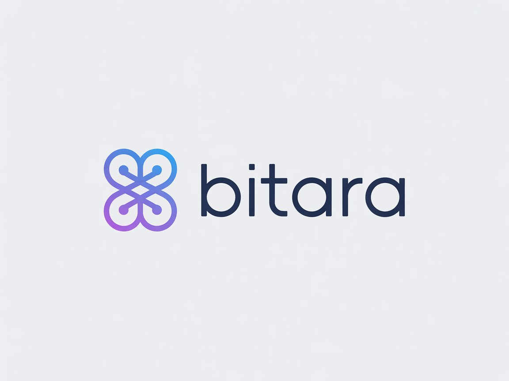
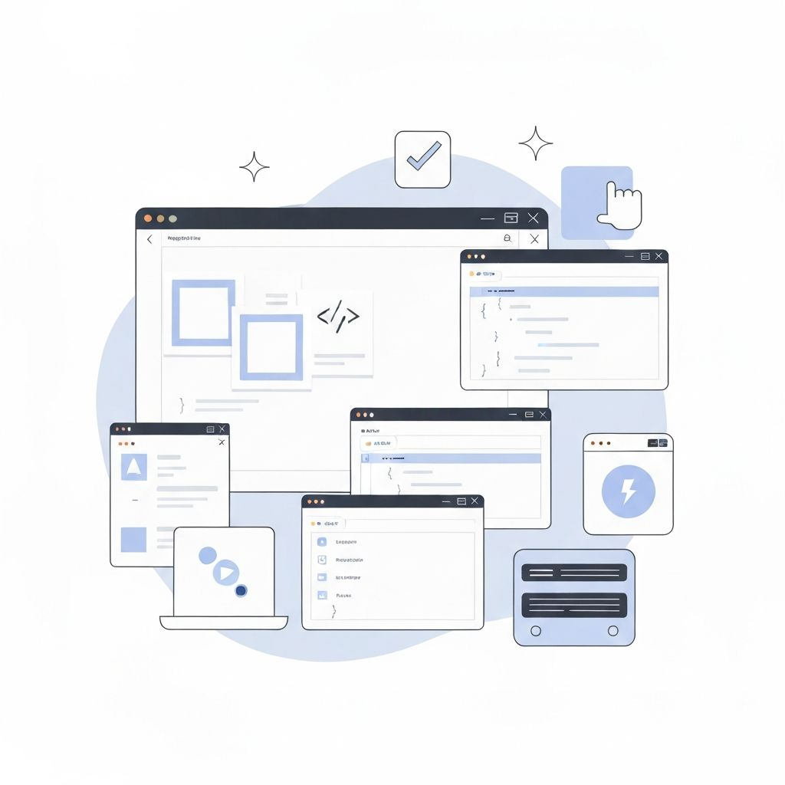
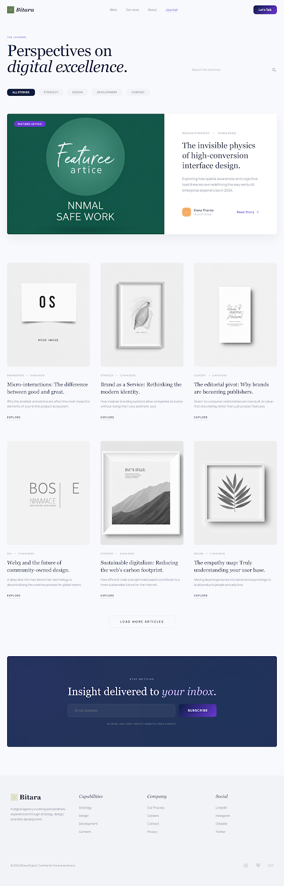

# Bitara Digital

<div align="center">
  

  <h3>Editorial-style agency website for custom websites, SaaS products, UI/UX design, and SEO-focused content.</h3>

  <p>
    <a href="https://www.bitaradigitalit.com">Live Website</a>
    |
    <a href="http://pharmacy.bitaradigitalit.com/">Featured SaaS Demo</a>
  </p>

  <p>
    
    
    
    
    
    
  </p>
</div>

<p align="center">
  
</p>

## Overview

Bitara Digital is a polished agency website built with the Next.js App Router. It combines a premium landing page, featured project showcase, searchable editorial blog, SEO-first metadata, and a contact workflow designed to turn visitors into qualified project inquiries.

This repository is the website itself. The site also presents broader agency capabilities such as NestJS, MongoDB, PostgreSQL, WordPress, and Figma, while the implementation in this codebase is focused on the frontend stack shown in the badges above.

## Highlights

- Premium editorial-style homepage with strong typography, portfolio storytelling, and market-focused messaging
- 46 statically generated blog articles with category filters, search, related posts, and dedicated article pages
- SEO-ready setup with metadata, JSON-LD structured data, canonical URLs, `robots.ts`, and `sitemap.ts`
- Featured project showcase with real portfolio visuals and a live pharmacy SaaS reference
- Mailto-based project inquiry form that prepares a structured brief for `hello@bitaradigitalit.com`
- Reusable UI foundation built on Radix UI primitives, Tailwind CSS, and shared site content definitions

## Screenshots

<table>
  <tr>
    <td width="50%">
      
      <p align="center"><strong>Editorial blog landing page</strong></p>
    </td>
    <td width="50%">
      
      <p align="center"><strong>Long-form article experience</strong></p>
    </td>
  </tr>
  <tr>
    <td width="50%">
      
      <p align="center"><strong>Services, stats, and selected works</strong></p>
    </td>
    <td width="50%">
      
      <p align="center"><strong>Process, values, and CTA sections</strong></p>
    </td>
  </tr>
</table>

## Tech Stack

### Built in this repository

- Next.js 16 with the App Router
- React 19
- TypeScript 5
- Tailwind CSS 4
- Radix UI primitives
- Lucide React icons
- Form and validation tooling dependencies via React Hook Form and Zod
- Vercel Analytics

### Agency capabilities showcased on the website

- Next.js
- NestJS
- MongoDB
- PostgreSQL
- WordPress
- Figma

## Project Structure

```text
.
|-- app/                # App Router pages, metadata, blog routes, sitemap, robots
|-- components/         # Landing page sections, editorial UI, shared primitives
|-- hooks/              # Small reusable hooks
|-- images/             # Screenshot assets used for documentation and previews
|-- lib/                # Site content, blog data, URL helpers, shared utilities
|-- public/             # Public images, logos, icons, and portfolio visuals
|-- styles/             # Additional global styles
|-- package.json
`-- tsconfig.json
```

## Getting Started

### Prerequisites

- Node.js 20 or newer
- npm

### Installation

```bash
npm install
```

### Development

```bash
npm run dev
```

Open `http://localhost:3000` in your browser.

### Production Build

```bash
npm run build
npm run start
```

> Windows PowerShell note: if script execution is restricted on your machine, run `npm.cmd run dev` or `npm.cmd run build`.

## Available Scripts

```bash
npm run dev
npm run build
npm run start
```

## Content and SEO Notes

- Core brand, service, market, project, and blog content is centralized in `lib/site-content.ts`
- Blog routes are statically generated from structured content data
- Metadata is configured at both layout and page level for stronger search presentation
- JSON-LD is included for organization, service, FAQ, collection, breadcrumb, and article schema
- `app/sitemap.ts` and `app/robots.ts` support crawlability and indexation

## Customization

To adapt this project for another brand or client, start here:

- Update brand identity, URLs, email address, services, markets, and project data in `lib/site-content.ts`
- Replace public images in `public/` and screenshot assets in `images/`
- Adjust page sections in `app/page.tsx` and the corresponding section components in `components/`

## Deployment

This project is well suited for deployment on Vercel or any Node.js hosting platform that supports Next.js 16.

For production deployment:

```bash
npm run build
npm run start
```
